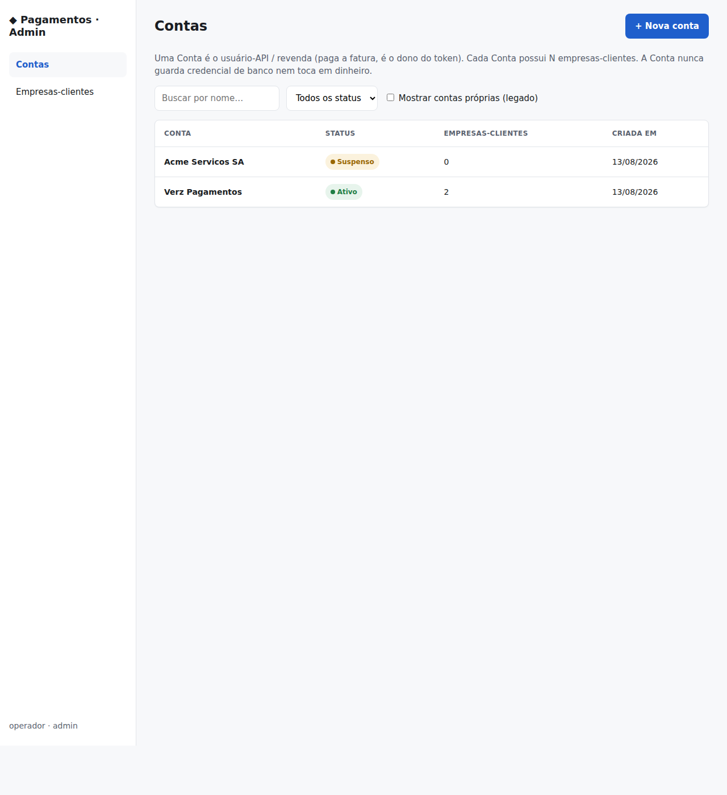
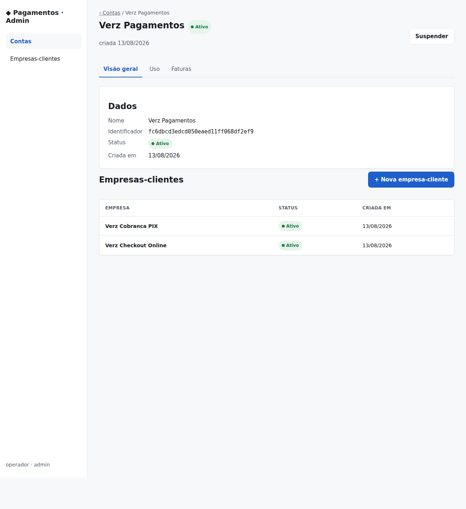
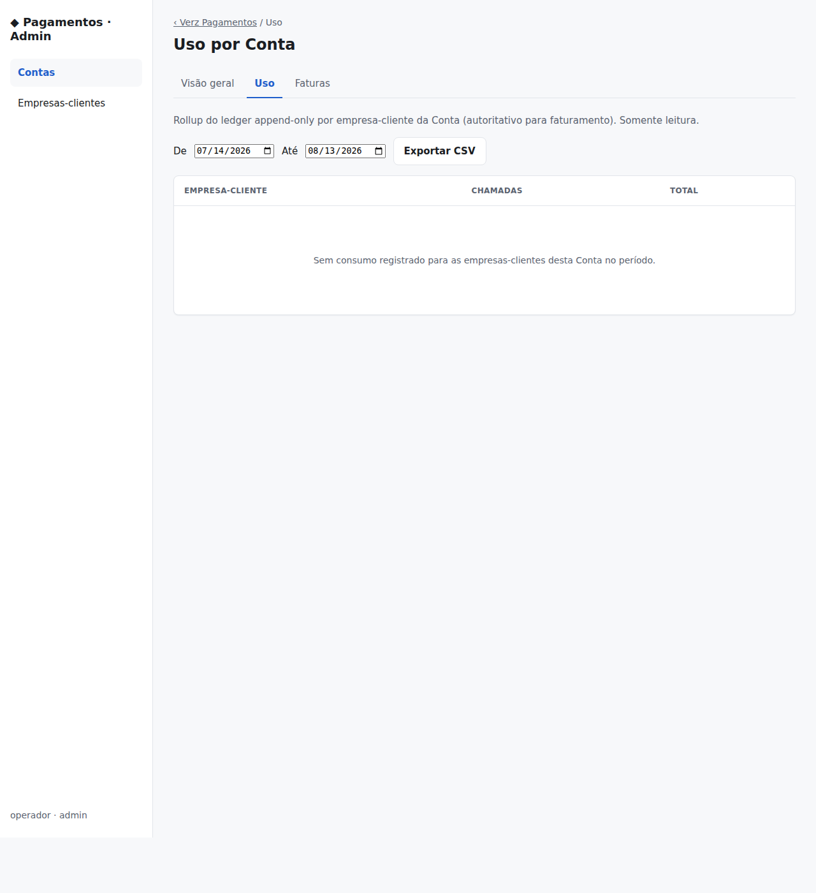
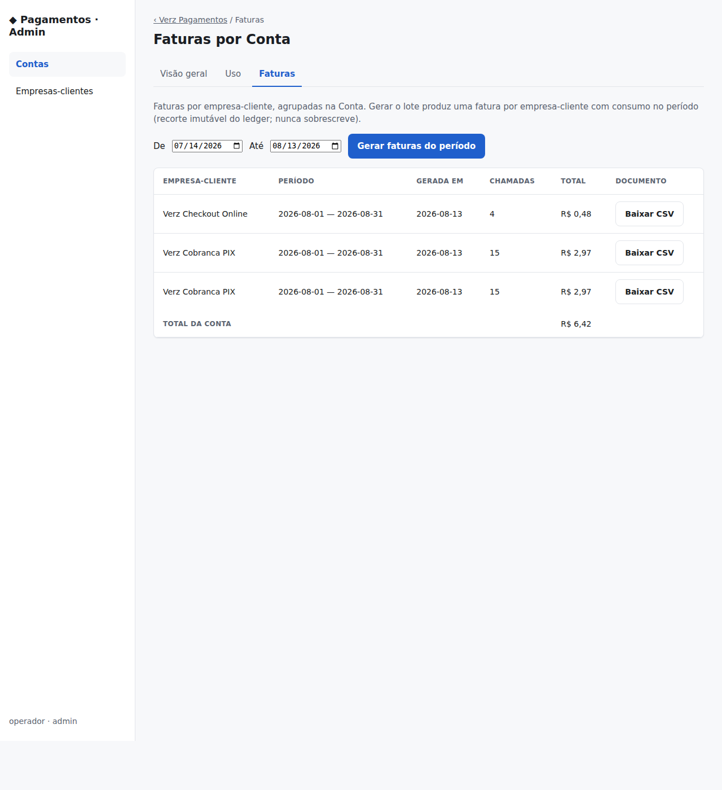
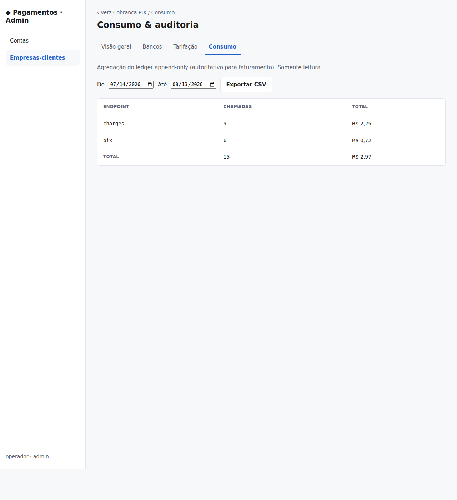
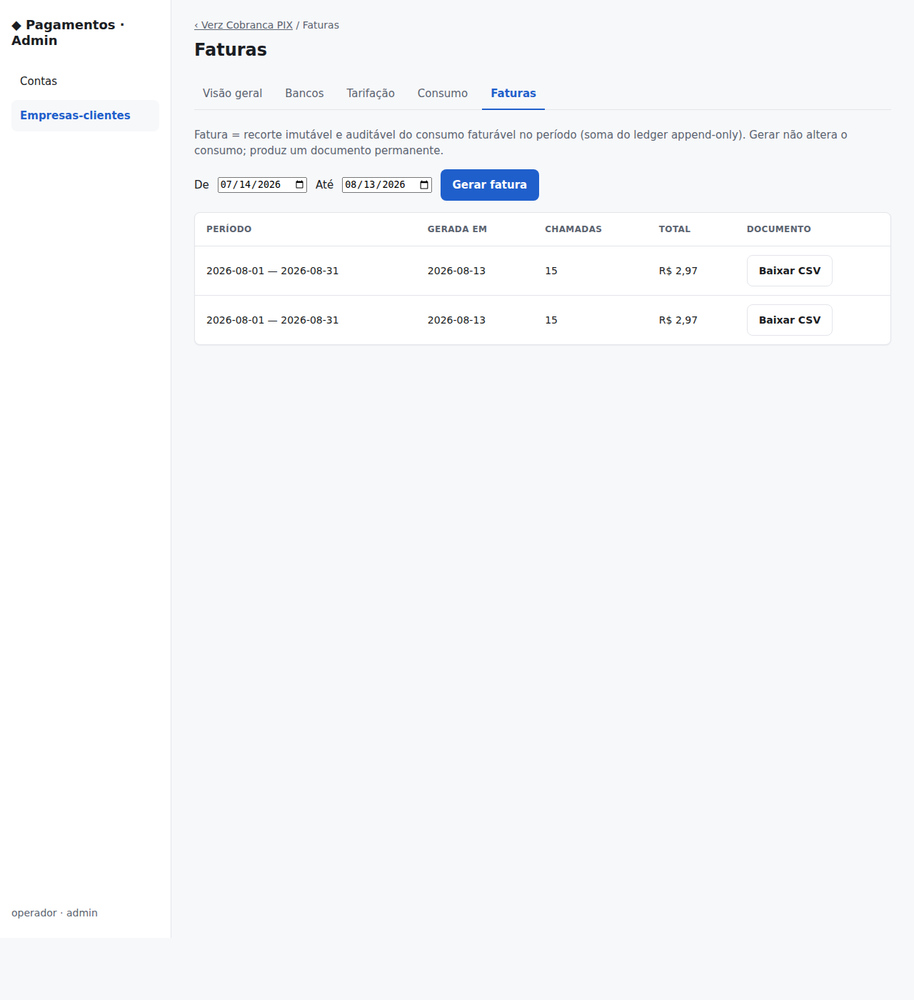

# Preview da área de administração (console admin) — 2026-08-13

> **SIN-69221 / SIN-69118.** Instância **visualizável** do admin do `payment`
> rodando em **modo stub** (sem C6 real, sem processamento de pagamento real,
> nenhum segredo de produção). Objetivo: o board revisar a "área de administração"
> — Contas × empresas-clientes, uso/consumo e Faturas — antes do cutover PROD real
> (que segue *gated* em credenciais C6 PROD + cert mTLS Verz).
>
> Binário: `cmd/api` no commit `563f0e0` (fork `main`, toda a engenharia do
> go-live mergeada). Config: `PAYMENT_C6_BASE_URL` vazio → adapter **in-memory**.

## Dados de exemplo (seed)

- **Conta "Verz Pagamentos"** (Ativa) com 2 empresas-clientes: *Verz Cobranca PIX*
  e *Verz Checkout Online*.
- **Conta "Acme Servicos SA"** (Suspensa) — para mostrar variação de status.
- Consumo real gerado por chamadas à API tenant (`POST /v1/charges`): tarifas por
  rota (`charges` R$0,25; `pix` R$0,12) → ledger append-only.
- Faturas geradas (recorte imutável do ledger no período).

---

## 1. Contas (lista) — `/console/accounts`

Lista de Contas (usuário-API / revenda). A Conta é dona do token e paga a fatura;
nunca guarda credencial de banco nem toca em dinheiro.



## 2. Conta → Visão geral + empresas-clientes — `/console/accounts/{id}`

Detalhe da Conta "Verz Pagamentos" com suas 2 empresas-clientes e abas
**Visão geral · Uso · Faturas**. Botões **Suspender** e **+ Nova empresa-cliente**.



## 3. Uso por Conta — `/console/accounts/{id}/consumption`

Rollup do ledger por empresa-cliente da Conta (autoritativo p/ faturamento),
com filtro de período e **Exportar CSV**.

> ⚠️ **Nota (achado, não-bloqueante):** neste preview a tela aparece **vazia**
> porque o *account_id* carimbado no ledger em tempo de cobrança é o **self-account**
> (`acct-<tenantID>`, F1), e não a Conta-pai que a UI de admin agrupou. O rollup
> por Conta consulta `ledger.account_id = <Conta>` → vazio. As telas por
> empresa-cliente (§5) e as Faturas (§4) **não** dependem disso e mostram os dados
> corretamente. Follow-up de engenharia aberto para resolver a Conta-pai no
> choke-point de auth (metering account-resolution).



## 4. Faturas por Conta — `/console/accounts/{id}/invoices`

Faturas por empresa-cliente agrupadas na Conta. "Gerar faturas do período" produz
uma fatura por empresa-cliente (recorte imutável do ledger; nunca sobrescreve).



## 5. Consumo por empresa-cliente — `/console/tenants/{id}/consumption`

Agregação do ledger por rota (`charges`, `pix`) da empresa-cliente, com totais e
CSV. Aqui o consumo real aparece: 9 `charges` + 6 `pix` = 15 chamadas, R$ 2,97.



## 6. Faturas por empresa-cliente — `/console/tenants/{id}/invoices`

Faturas (recorte imutável) da empresa-cliente. Duas linhas do mesmo período =
append-only (uma gerada no nível empresa, outra no lote da Conta): o design
**nunca sobrescreve** uma fatura; cada geração é um documento permanente.



---

## Como reproduzir localmente (modo stub, sem C6)

```bash
# Go 1.26 (repo pina 1.26). Build:
CGO_ENABLED=0 go build -o payment-api ./cmd/api

# Rodar em modo stub (adapter in-memory), com tokens de admin/operador:
PAYMENT_HTTP_ADDR=127.0.0.1:8099 \
PAYMENT_DB_PATH=/tmp/payment-demo.db \
PAYMENT_ADMIN_TOKENS=demo-admin-token \
PAYMENT_OPERATOR_TOKENS=demo-operator-token \
PAYMENT_C6_BASE_URL= \
PAYMENT_SECURE_COOKIES=false \
./payment-api
```

Autenticação do console é **Bearer** (`Authorization: Bearer demo-admin-token`).
Como o browser não envia esse header em navegação direta, para *ver* no navegador
use um proxy local que injeta o header, ou consuma via `curl`. O caminho de
entrada é `GET /console/accounts`. Mutações exigem token **admin** + CSRF
double-submit (cookie `csrf_token` ecoado no campo/`X-CSRF-Token`).

> Para gerar consumo é preciso, além de tarifa por rota, uma credencial de banco
> stub por empresa-cliente (roteamento multi-banco fail-closed):
> `PAYMENT_BANK_CREDS="<tid>:c6:cid:secret"` +
> `PAYMENT_BANK_CREDITOR_KEYS="<tid>:c6:chave-pix"`. Sem C6 real, o banco é o stub
> in-memory e as cobranças retornam 201 sem tocar em dinheiro.
